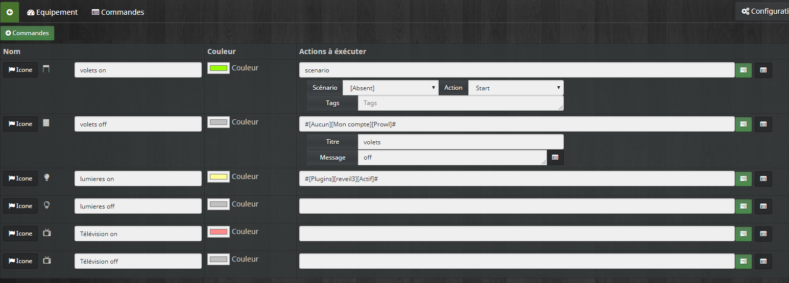
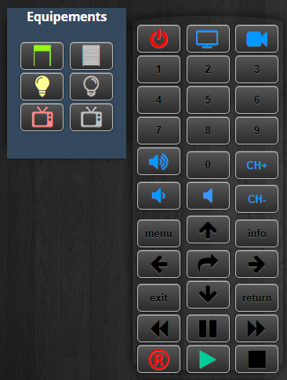

Description 
===

Ce plugin permet de créer des télécommandes virtuelles et d'assigner des actions (unique,message,scénario...) aux boutons.

Installation
=============

Comme n'importe quel plugin.

Après l'avoir activer ,  il faut ensuite aller dans Plugins/Organisation/Telecommande.

Configuration
===

Rien de plus simple.Créer une télécommande en cliquant sur le plus (personnalisée ou multimédia). Les boutons sont déjà crées pour la multimédia. Pour la personnalisée , cliquer sur "+commandes" pour en ajouter autant que vous voulez. Si aucune icône n'est sélectionnée c'est le nom de la commande qui apparaît. Vous pouvez aussi choisir la couleur de l'icône.

Les widgets
===

A gauche le widget d'une télécommande personnalisée.
A droite la télécommande "multimédia" . Taille définie en mode modification et La configuration avancée permet de la rentre transparente , enlever le nom ( options de base)

